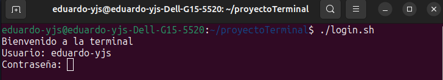
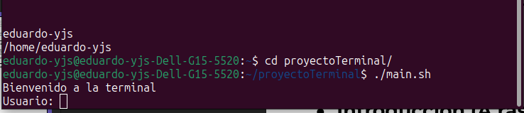
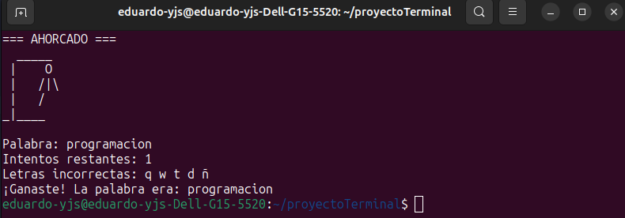

# Terminal Bash Personalizada

Una terminal de trabajo en Bash diseñada como proyecto final de capacitación en Linux. Incluye un sistema de acceso, comandos personalizados, un juego textual, un reproductor de música con interfaz gráfica y documentación.

## 📌 Descripción breve

Esta terminal simula un entorno personalizado para usuarios en sistemas Linux. Permite autenticación de usuarios y la ejecución de diversos comandos educativos y lúdicos.

## 🚧 Estado del proyecto

✅ Completado – funcional y listo para evaluación.  
📅 Fecha de entrega: 26 de abril de 2025.

## 🖼️ Capturas

  
  
  

## ⚙️ Instalación rápida

```bash
git clone https://github.com/usuario/terminal-bash.git
cd terminal-bash
bash main.sh
